# Assignment 1

NOTE: Copies of the source for this file (which makes it easier to copy out of) will be available at https://github.com/colinoflynn/eced3403-computer-architecture . This includes copies of the `.c` source files, and other reference material. Copies of some of these are also available on Brightspace.

See Brightspace for due dates for this assignment.

## Part 1: Predictable Preprocessor Ponderings [10 pts]

In this part of the assignment you will explore the C preprocessor to understand how it works, as well as to understand how you can debug preprocessor issues and see the output of the preprocessor.

### Part 1 Setup:

For this part of the assignment, you will need to enable the compiler to output pre-processed output. The following shows how to set this up using Segger Embedded Workbench.

1. Install and setup Segger Embedded Workbench per the Lab 1 setup documentation.
2. Make a new project (see Lab 1 documentation).
3. Right-click on the project and select `Options`:
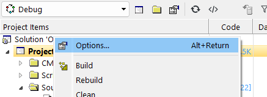
4. Search for `preprocessor` and enable the `Keep Preprocessor Output` option:
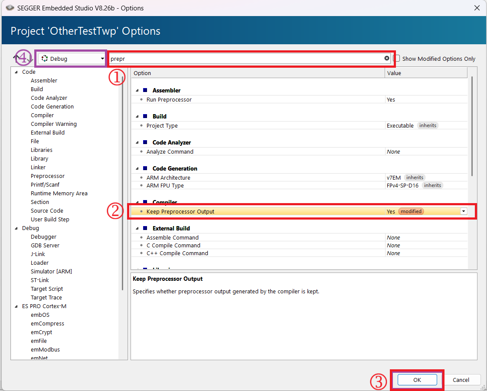

Be aware that these options get set seperately for each "build type" - here I've highlighted that I'm modifying the `Debug` build for example. You shouldn't need to change this, but be aware if later you toggle between debug and release builds you will see your options change.

5. Build the example project (again, see Lab 1 documentation).
6. Select the `Open File` menu item. Assuming your project is called `<ProjectName>`, you should find a file called `main_PP.c` in the directory `<ProjectName\Output\Debug\Obj\<ProjectName>\main_PP.c`, as shown here:
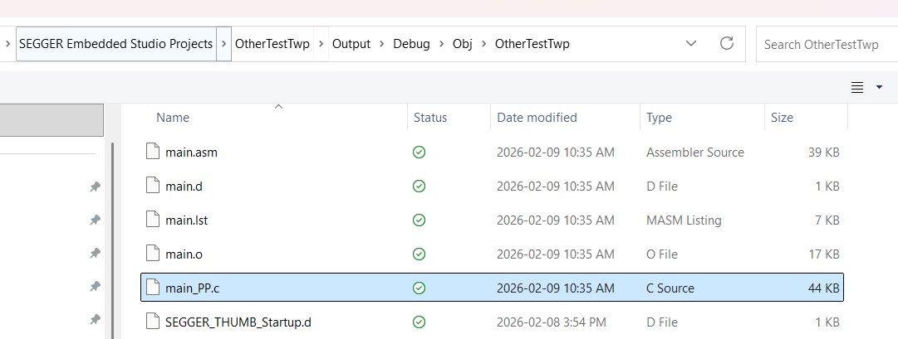

Note that when you rebuild the project you will be asked to reload this file, which you will have to hit **Yes** to. This file contains the pre-processed output. Using this file, you can answer the first part of these questions.

### Part 1-A:

##### 1-A-1 [ 1 pt ]
  *  What is the value of `ID_SUM`?
##### 1-A-2 [ 1 pt ]
  * What is the value of `ID_WEIGHTED`?

### Part 1-B:

For this part, look at the section of the file titled `PART 1-B: Pre-processor conditional statements`

##### 1-B-1 [ 2 pt ]
  * What is the value of `MODE` that is defined for your specific student ID? 
  * Why is this defined selected? Reference the values calculated above.

### Part 1-C:

For this part, look at the section of the file titled `PART 1-C: Pre-processor macros`

* 1-C-1 [ 2 pt ]
  * What does the `##` operator do in the C pre-processor.
  * What is the expanded line `int MAKE_VAR(5) = DIGIT(2)*200;`? Your answer should be the pre-processed output.
  
* 1-C-2 [ 4 pt ]
  
    Change the source code to call `CAT()` directly intead of `CAT_EXPAND()`. The code should look like this:
        
```c
#define CAT(a,b) a##b
#define CAT_EXPAND(a,b) CAT(a,b)
#define DIGIT(n) STUDENTID##n
#define MAKE_VAR(n) CAT(id_, DIGIT(n))
```

Note the difference is on the final line - instead of the macro `CAT_EXPAND()`, it is directly using `CAT()`. Try to build the code and answer the following:

  * What error(s) do you get when building?
  * What is the output of the pre-processor (you will need to use the pre-processed output file), that is when looking at the pre-processed file what does that same `int MAKE_VAR(5) = DIGIT(2)*200;` line look like now?
  * Why does this happen?

## Part 2: C Compiler Contents [15 pts]

In this part of the assignment you will inspect the C compiler listing file, and investigate some various C compiler options to understand how it impacts the resulting code.

To begin, enable the Listing Output in Embedded Workbench. To do this, again open the *Project Options*, and search for `Listing`. Toggle that option to `Yes` as shown here:

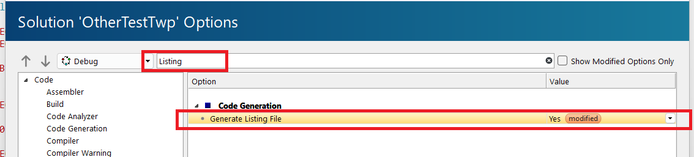

If you rebuild your example project, you will find a file called `main.lst` in the same location of the `main_PP.c` from Part 1. Open that file in the editor - again it will need to be reloaded every time you rebuild (you may be able to turn on an automatic reloading, or open in an external editor that supports this).

This file includes the resulting assembly code for given C code, with the Arm machine code. For example if you added the following function to `main.c`:

```c
int SomeTestFunction(int a, int b, int c)
{
    return a + b + c;
}
```

You should see the following in `main.list`:

```
int SomeTestFunction(int a, int b, int c)
{
   0:	b083      	sub	sp, #12
   2:	9002      	str	r0, [sp, #8]
   4:	9101      	str	r1, [sp, #4]
   6:	9200      	str	r2, [sp, #0]
    return a + b + c;
   8:	9802      	ldr	r0, [sp, #8]
   a:	9901      	ldr	r1, [sp, #4]
   c:	4408      	add	r0, r1
   e:	9900      	ldr	r1, [sp, #0]
  10:	4408      	add	r0, r1
  12:	b003      	add	sp, #12
  14:	4770      	bx	lr

Disassembly of section .text.SomeFunction:

00000000 <SomeFunction>:
}
```

Where the hex values such as `b083` (line `0`) is the actual machine code, and `sub sp, #12` is the associated Arm assembly code. This listing output can be very helpful in understanding what the compiler is doing.


In previous examples, we have just been switching between a `Debug` and a `Release` build to enable optimizations. In this section you will change optimization settings for the `Debug` build itself. This is required as we want to keep all the rest of the `Debug` features and options the same, changing **ONLY** the optimization settings or level.

To complete this part, you will need to switch between two optimization levels. To do this, again in the project options search `optimization` and you have the options:

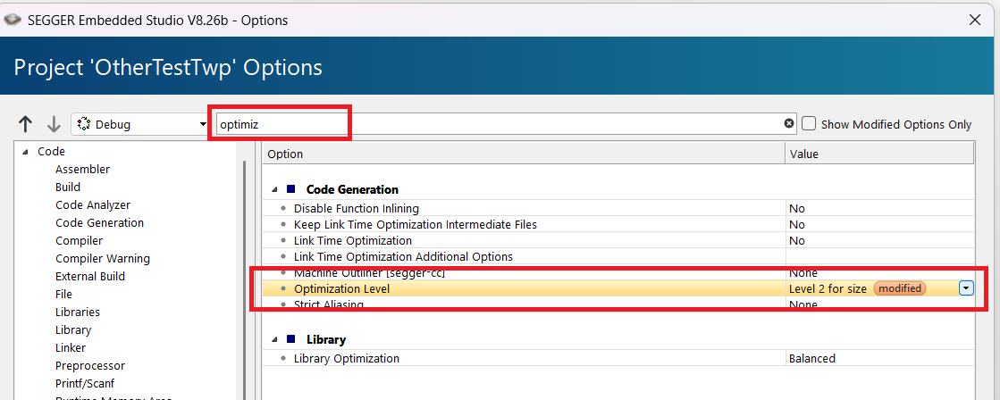

In the following answers, you will need to switch this between **None** (for OFF) and another level of your choice.

For your answers, specify the optimization level you used for the optimized output. The code may look different for different levels.

##### 2-1 [ 3 pts ]

Report the listing (compiler) output for the following function with optimizations ON and OFF. Include a short summary of the differences between optimized and unoptimized, reference for example changes in memory or register usage.

```c
int SomeTestFunction(int a, int b, int c)
{
    return a + b + c;
}
```

##### 2-2 [ 6 pts ]

The following has an arithmetic loop. For the following code, compile with the following settings and compare the results similar to the previous question (including both code output as well as a short summary of changes you see).

| Code                                  | Optimizations |
|---------------------------------------|---------------|
| As Below                              | Off           |
| As Below                              | On            |
| Change loop ending from `10` to `2`   | On            |
| Change loop ending from `10` to `100` | On            |


```c
int AddLoopTest(int a){
  int rv = 0;

  for(int i = 0; i < 10; i++){
    rv += a;
  }

  return rv;
}
```

##### 2-3 [ 6 pts ]

The following has a loop with a function call. For the following code, compile with the following settings and compare the results similar to the previous question (including both code output as well as a short summary of changes you see).

| Code                                  | Optimizations |
|---------------------------------------|---------------|
| As Below                              | Off           |
| As Below                              | On            |
| Change loop ending from `10` to `2`   | On            |
| Change loop ending from `10` to `100` | On            |

```c
void PrintLoopTest(void){

  for(int i = 0; i < 10; i++){
    printf("Hello %d\n", i);
  }

  return;
}
```

## Part 3: Modifying Machine Code [10 pts]

In this part of the assignment you will modify the binary (machine) code to understand how the machine code is written to internal memory.

### Part 3 Setup

For Part 3, you should *create a new project*. We would like to have again default optimization and debug levels for this part of the work.

Adjust the `main.c` default file to have a simple loop that runs through 25 times:

```
int main(void) {
  int i;

  for (i = 0; i < 25; i++) {
    printf("Hello World %d!\n", i);
  }
  do {
    i++;
  } while (1);
}
```

Build and start a debug session for this program. Ensure the `Disassembly` view is open (again see Lab 1 instructions if unsure).

Then:

1. Open the memory window/display (see Lab 1 if unsure).
2. Set the starting address of the memory window to the starting address of the `for()` loop based on the disassembly code.
3. Set the memory window to display 16-bit integers instead of the default 8-bit.
4. Notice that the machine code displayed in the disassembly window now.

These steps are shown here:

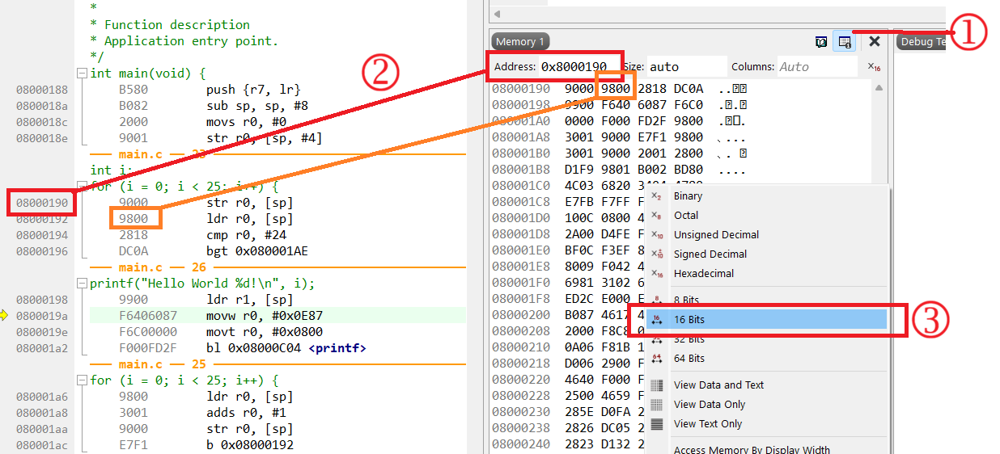

You can modify the machine code by clicking on the memory window and writing new hex. For example here I changed my original code from `2818` to `2822`. Note this won't actually be written to hardware until I press either the **Go** or **Step** button in the debugger. When this happens you will see a short window pop up as the flash (code) memory is re-written.

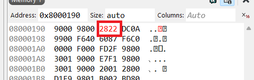

Note that the disassembly window **does not** show the actual flash contents here - it still shows the original code. Thus you will not see your change reflected in the debugger, it will show you the expected output. Some debuggers may detect this, but in this example it does not.

To understand the machine code, you can look at each 16-bit instruction, which in this example is a **Thumb** instruction set. Here I have written out the instruction that performs a load of `r0` with the first value stored on the stack (`[sp]`):

```
 9800        ldr r0, [sp]
```

In binary, this would be:

```
1 0 0 1 1 0 0 0 0 0 0 0 0 0 0 0
```

A reference for all the Thumb instruction encodings is provided here:

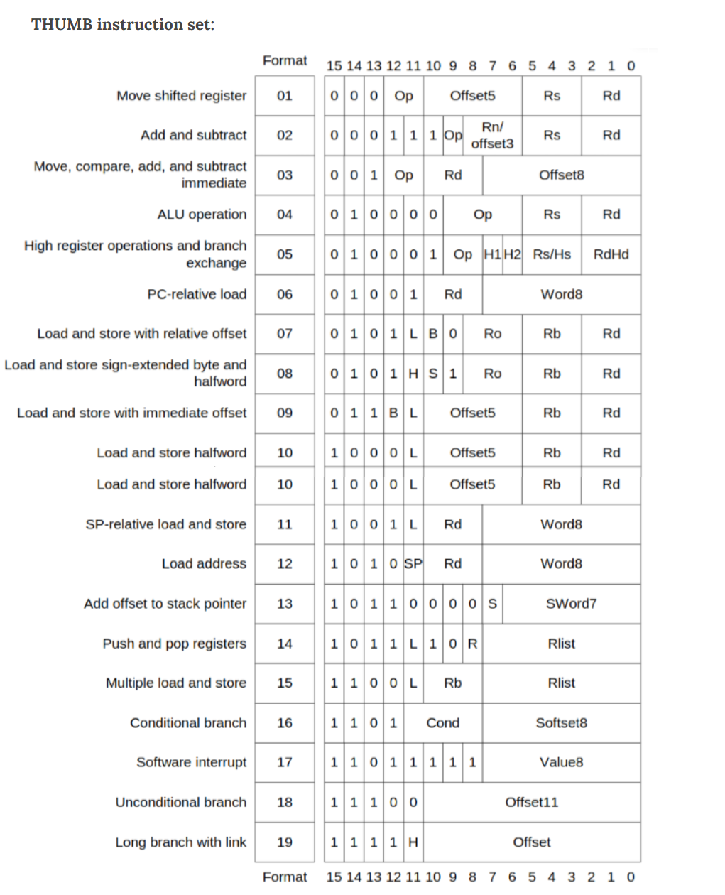

Looking through the table for example, you could see the encoding as described here:

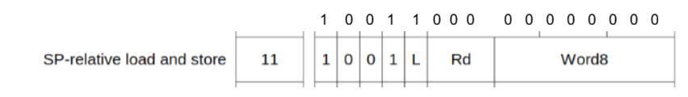

We can see that decoding from left (MSB, bit 15) to right (LSB, bit 0):
* `1 0 0 1` defines the *SP-relative load and store*
* `1` defines the `L` value, this is set to `1` so this is a **Load** (if `0` this would be a **Store**)
* `0 0 0` defines `Rd`, the target register, which is `R0`
* `0 0 0 0 0 0 0 0` is the offset from the stack pointer, in this case which is `0x00`

If I asked you to modify this to load for example the value into R2, you could just change `Rd` to `0 1 0`, making the new encoding:

```
1 0 0 1 1 0 1 0 0 0 0 0 0 0 0 0
```

Which would be:

```
0x9A00
```

A more complete quick reference guide is available at [https://documentation-service.arm.com/static/5ed66080ca06a95ce53f932d](https://documentation-service.arm.com/static/5ed66080ca06a95ce53f932d) - this is also copied to the Brightspace and repository.

##### 3-1

[4 pts] Decode the `cmp` instruction from the *machine code*. Decode it to a binary code as above, and then specify where each argument comes from just as done in the example above.

##### 3-2

[6 pts] Modify the binary arguments such the loop iteration runs only up until your **last two digits of your B00 number**. For example if my student number was **B00123456**, I need to modify the loop such that it prints:
```
Hello World 0!
Hello World 1!
Hello World 2!
...
Hello World 0!
Hello World 1!
Hello World 56!
```

Include in your answer:

1. the binary code you wrote.
2. A decoding as in the previous question.
3. A screenshot of your working code showing the debugger with the modified memory, the terminal window output showing the final "Hello World" results, and the debugger disassembly view.

## Part 4: Studying Stack & SRAM [20 pts]

In this part of the assignment you will use the Debugger (see Lab #1) to inspect the memory to better understand how the stack is stored and used. You will also see visually what happens when the stack is overwritten, and see how you can debug this using common debugger tools.

Build the following code using default `Debug` setup (no optimizations):

```c
#include <stdio.h>

void recurse(int a){
  if (a > 0){
    a--;
    recurse(a--);
  }
}

int important_global_variable = 0xFEEDFACE;

int main(void) {
  int depth = 5;

  printf("Value of important variable: %x\n", important_global_variable);
  printf("Attempting to recurse: %d\n", depth);
  recurse(depth);

  printf("Back home :)\n");
  printf("Value of important variable: %x\n", important_global_variable);

  while(1);

}
```

By changing the value of `depth` you can trigger different recursive function calls, which if optimizations are off will use different amounts of stack space for the recursion.

1. Start the debugger with a board attached.
2. Set a breakpoint on the call to `recurse(depth)` from `main()` - run the code and it should stop before that call.
3. Find the value of the `sp` register, and copy that value to the memory window:

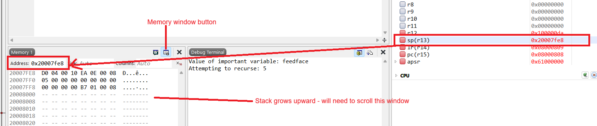

4. You will need to scroll the memory upward, remember the stack grows downward from high memory addresses, which will look "upward" in the window. Scroll the window up. Fill an earlier memory location with `FF` up to the stack pointer location (do not overwrite the stack pointer location). To do this put your key in the memory window and hold down the `F` button, it should quickly fill up:


If you make a mistake simply reset the processor and try again. Note you may need to right-click on the memory window and set it back to **8-bit** view if changed to 16-bit earlier in the assignment.

5. Use the **Step Into** command in the debugger to step through the recursive function. You will see each stack frame written to the memory space. Pre-filling the memory with `FF` makes it very obvious when new data is written, since the new data appears as a change in RED.

6. Continuing hitting **Step Into** until you reach the end of the recursion (set to 5 here should be fairly quickly). You can observe the stack growing through each recursion, and the return to the main function. Once in the main function use **Step Over** to step over `printf()` calls.

Using the above and the debugger introduction from Lab 1, you should be able to answer the following:

##### Part 4-1: Stack Frames

[10 pts] Draw a diagram of the stack frame at the end of the recursion (e.g., after the final call), **before** the function returns. To do this you will need to reference:

* Disassembly code of the function
* The debugger memory view
* Class notes

Your diagram should have:

* Memory addresses
* The stack pointer location
* Notations on what the bytes mean in reference to the functions (return values, local variables, filler, etc)


##### Part 4-2: Stack Overflow

[10 pts] Change the initialization of `depth = 5;` to `depth = 2500;` and run the function again. Using the debugger, answer:

* What happens?
* What is the value of `important_global_variable` after this attempt?
* Was `important_global_variable` corrupted - why or why not? In your answer to this you will need to reference:
  * The address where `important_global_variable` is located at.
  * The memory map of the STM32F3 - note there are some different RAM segments that may be used by the compiler.
* You may use the same method of overwriting memory to observe the stack. Restart the process and move the memory window to the start of memory (HINT: Use the memory map to determine this, Segger helpfully marks invalid memory as `--` as shown here:
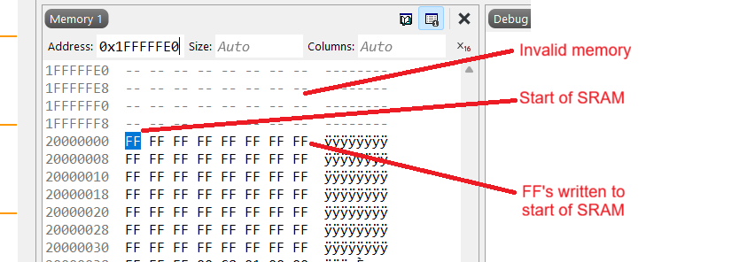
* Run the code again, and then inspect the memory at the **start** of SRAM. Using your knowledge of the stack, what was the final value of the **depth** variable passed to the final function call before the crash?


~~~~~~~~~~~~~
