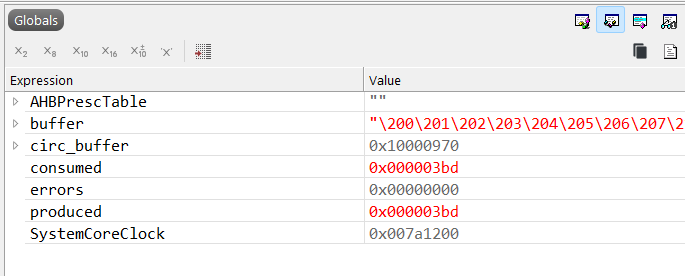

# Assignment 2: Circular Buffers

## Part 1: Background

A *circular buffer* or *circular queue* is an important data structure in embedded devices. It is often used to add data to a queue from an interrupt routine, and use the data in a main loop.

They are also vulnerable to race conditions and being corrupted by interrupts. In this assignment you will explore these buffers.

Be aware that for Part I we *did not* cover this topic in class, instead I'm asking to "do your own research" (not in a facebook-conspiracy way however). You will use your background from Part I to help you answer Part 2, which explores them under ISR interference.

### Buffer Backgrounds

##### 1-1 [ 5 pts ]

What is a circular buffer? Your answer should include:

* High-level overview of a buffer
* Diagrams showing how the head and tail pointers work in a buffer. This diagram should show the buffer as a rectangle showing the memory buffer, with arrows showing the head and tail pointers in four situations:
  * At the initial state (buffer empty)
  * After some data is added (not yet full however)
  * After data is removed (but not yet empty)
  * How the head and tail pointers wrap around

##### 1-2 [ 5 pts]

We will use an example of FreeRTOS Queue, source: [https://github.com/FreeRTOS/FreeRTOS-Kernel/blob/1dbc77697f4c63e1b18a2c7f7a15aad4ae14af7e/queue.c#L949](https://github.com/FreeRTOS/FreeRTOS-Kernel/blob/1dbc77697f4c63e1b18a2c7f7a15aad4ae14af7e/queue.c).

Look at the function `xQueueGenericSend` on Line 949 [linked here](https://github.com/FreeRTOS/FreeRTOS-Kernel/blob/1dbc77697f4c63e1b18a2c7f7a15aad4ae14af7e/queue.c#L949). Answer the following questions (NOTE: The prior link should be static and go to the same version as I reference below, please ensure you use that link to get the same git checkout).

In the following questions the notation `L949` will mean "Line 949".


* On `L971` there is `taskENTER_CRITICAL()`. Based on your knowledge from the lab, why do you think that is needed?
* Trace the function and find every way the control flow "exits". That is after `taskENTER_CRITICAL()` the function can do several things, including returning early and continuing past this code. List all of the locations that a matching `taskEXIT_CRITICAL();` is found (provide line numbers).
* What would happen if control flow exited without a `taskEXIT_CRITICAL();`?

### Part 2: Interrupt-Safety Improvements

Find the source code `eced3403_assignment2_circular.c` at [https://github.com/colinoflynn/eced3403-computer-architecture/tree/main/assignments/assignment2/eced3403_assignment2_circular.c](https://github.com/colinoflynn/eced3403-computer-architecture/tree/main/assignments/assignment2/eced3403_assignment2_circular.c). Copy this code to a new project (per previous labs).

The code consists of a producer (from the interrupt):

```c
void SysTick_Handler(void) {
    if(circular_buf_put2(circ_buffer, next_byte()) == 0){
      produced++;
    }
}
```


And a consumer in the main thread:


```c
        if (circular_buf_get(circ_buffer, &b) == 0) {
            consumed++;

            // Check stream consistency: should be sequential mod 256
            if (b != expected) {
                errors++;
                expected = b;      // resync so we can keep counting errors
            }

            expected++;
        }
```

Using the debugger, you can inspect the global variables `produced` and `consumed` to see they should match up. The code also checks the data is the expected sequence, and if so should leave `errors` at 0:



To test this:

1. Build and debug the target.
2. Run the target for 5 seconds.
3. Pause the debugger and inspect the global variables.

If you see any errors, restart the debugger.

The rate of interrupts is changed by setting `SysTick->LOAD` to a different value, a smaller value means MORE interrupts fire. Eventually the code is just continously running the interrupt (and the main loop will not run) if you set this too small.

```c
// SysTick setup: adjust rate to make failures appear quickly
    SysTick->LOAD = 20000; // Defines interrupt speed
```

The default value of `20000` makes errors unlikely as the interrupt fires very rarely.

You will now be asked to change that value for both **DEBUG** and **RELEASE** builds. To complete this, you will have to:

* Change the value on the line from `20000` to each of the requested value: 50, 150, 200, 250, 500.
* Build and debug the code. Let it run for 5 seconds (you don't need to be too precise, use a phone stopwatch is fine, when we get to performance analysis we will look at how to use timers to do these tasks).
* Pause the code and inspect the value of `errors`, `consumed`, and `produced`.

After you run the normal **DEBUG** build, switch to **RELEASE** and do the same:


NOTE: These values should result in 50 having `consumed` stuck at 0 (as the interrupt fires too quickly), and at the higher end (500) there should be no errors. In-between you should see errors at some values (but not all depending on the build mode). If you need to adjust the LOAD values you can do so, just keep 5 different LOAD values you are using.

I will then ask you to find the disassembly of the `retreat_pointer()` function. See prior labs and assignments for the debug information you can use here, as well as enabling additional "listing" files which provide disassembly views.

You will then try to fix this by adding the required atomic functionality, as seen from Lab 2. Further details are in the specific questions to answer below:

#### 2-1 [ 10 pts ]

Observe the code (reset each time) running for 5 seconds. If an error/hardfault is thrown just reset and run again:

**DEBUG BUILD**:

| LOAD Value | Errors  | Consumed | Produced |
|------------|---------|----------|----------|
| 50         | FILL IN | FILL IN  | FILL IN  |
| 150        | FILL IN | FILL IN  | FILL IN  |
| 200        | FILL IN | FILL IN  | FILL IN  |
| 250        | FILL IN | FILL IN  | FILL IN  |
| 500        | FILL IN | FILL IN  | FILL IN  |


**RELEASE BUILD**:

| LOAD Value | Errors  | Consumed | Produced |
|------------|---------|----------|----------|
| 50         | FILL IN | FILL IN  | FILL IN  |
| 150        | FILL IN | FILL IN  | FILL IN  |
| 200        | FILL IN | FILL IN  | FILL IN  |
| 250        | FILL IN | FILL IN  | FILL IN  |
| 500        | FILL IN | FILL IN  | FILL IN  |

#### 2-2 [ 10 pts ]

Using either the disassembly listing file OR the debugger disassembly view, find the disassembly of the `retreat_pointer` function.

Provide a copy of the disassembly for **both DEBUG and RELEASE builds**, and annotate where memory access is happening at an assembly level.

Provide your "best guess" of where corruption is happening in both disassembly examples, again reference the memory access and how the interrupt may be accessing the same memory location. You may need to disassemble the interrupt as well to understand this. You may find it useful to use the debugger to cross-reference C and ASM code by single-stepping through the code.

For ONE of the builds (choose DEBUG or RELEASE):

Provide a short example of how this corruption would look - this should show practically what the memory "might" look like during a corruption event (e.g., show what memory is overwritten with a stale value, choose some example values to show how the tail/head become invalid).

#### 2-3 [ 10 pts ]

Using the atomic examples from the lab, fix the circular queue. Test your fix to confirm it works at a few different LOAD values, and with both build types. Report your results of your testing. Also suggest where else should have this operation added in the code, even if it didn't cause bugs in the *current* usage (e.g., what other areas if interrupted would cause similar problems).

For reference, here is the atomic code you were provided in Lab #2:

```c

// ------------------- atomic() helper -------------------
// Keep it tiny and restore prior state (important if nested / already masked)
static inline uint32_t atomic_enter(void) {
    uint32_t pm = __get_PRIMASK();
    __disable_irq();
    return pm;
}
static inline void atomic_exit(uint32_t pm) {
    __set_PRIMASK(pm);
}

// Convenience macro that looks like atomic(...)
#define atomic(block) do { \
    uint32_t __pm = atomic_enter(); \
    block \
    atomic_exit(__pm); \
} while (0)
```

You can use the `atomic()` macro on function calls easily as well which wraps both an `atomic_enter()` and `atomic_exit()`:

```c
//Interrupts on (maybe unsafe)
something();

//Same call atomically
atomic(something(););
```

For larger blocks use the full calls per the lab.