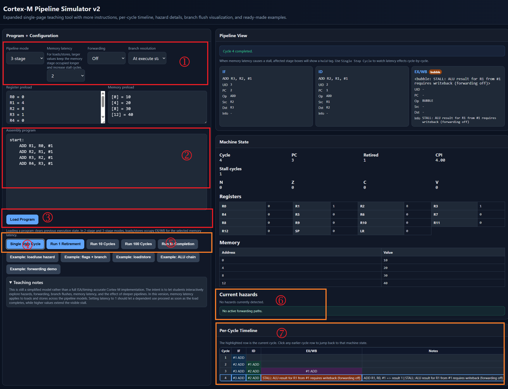
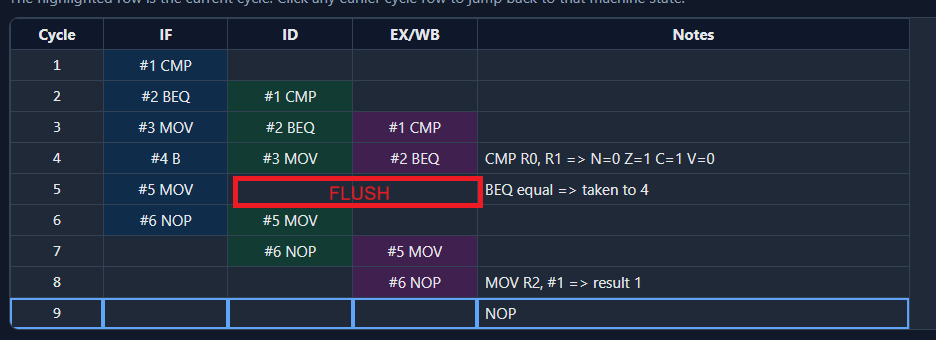

# Assignment 4: Pipelines

This assignment will use a (heavily vibe-coded) MCU pipeline simulator which is posted alongside the assignment. Note the following about this simulator:

* It has not been heavily tested - if you have problems try reloading the simulator
* It is NOT accurate to any specific architecture, but tries to copy the "feel" of small microcontroller pipelines
* It will work for at least the questions in this assignment. I've tested it on Chrome & Brave browsers.

In the following, referencing the numbers in the image:



1. Configure the microcontroller/pipeline set
2. Write any instructions here (only a subset of instructions are supported). If needed initial register and memory values can be given above.
3. Hit "Load Program". **THIS IS CRITICAL TO LOAD THE SETTINGS**. This resets the processor and is needed anytime you change a setting or program. Use this button to reset the program as well.
4. Hit **Single Step** to step through the code one cycle at a time (if there is stalls each instruction could take more than one instruction)
5. Hit **Run to Completion** to run the entire program.
6. During single-step, this will show hazards and forwarding (described below).
7. This will show a log of the pipeline status on each cycle. If you click on an entry the simulator rewinds to that entry, you can single-step forward from there.


#### 4-1: Forwarding [ 5 pts ]

A topic we didn't cover in class was the idea of *forwarding*. An overview video of this is for example available here: [https://www.youtube.com/watch?v=QOISznvT3lo](https://www.youtube.com/watch?v=QOISznvT3lo).

Forwarding allows us to skip the **Writeback** stage, when instructions are occuring which depend on the previous instruction. Consider the following two instructions:

```
1:    ADD R1, R0, #1
2:    ADD R2, R1, #1
```

The second instruction depends on the result of the first. Normally, we would have an **Execute** stage, which depending on how many pipeline stages would be followed by a **Writeback** (or it could have **Writeback** as part of execute).

If we have *forwarding*, it means that the system detects that the instruction in the Decode stage (and to be forwarded to Execute) requires the data value being written back. This could result in a stall, since it may need to wait to prepare for the execution of instruction #2.

Forwarding "short-circuits" the writeback, and loads the value into the ALU input for the next instruction directly (without going back to the register).

The simulator has a basic *forwarding* simulator that when forwarding is off will cause a stall. In the first question, you will see how that impacts the extra cycles in our simple program.

Configure your simulator as:

* Pipeline mode = 3-stage (Default)
* Memory latency = 2 (Default)
* Forwarding = **Off** (Different from default)
* Register preload & memory preload ignored

Load the following code:

```
start:
    ADD R1, R0, #1
    ADD R2, R1, #1
    ADD R3, R0, #10
    ADD R4, R3, #1
```

Run the code (single-step or to completion). With forwarding **Off** you should see that there is stalls between some instructions.

Now toggle Forwarding to **On**, and hit the **Load Program** button to reset the system.

Again run the code. You should not see stalls. Using this setup, answer the following questions:

4-1-1) [2 pts] Where were the stalls located? Add a per-cycle description of the execution showing where a stall was located when forwarding is OFF.

4-1-2) [1 pts] With forwarding ON, how many cycles did it save by removing the stalls? 

4-1-3) [2 pts] With forwarding OFF, can you re-order the program to avoid stalls? You can use the simulator to make sure register value `R2` and `R4` have the same result. What is your new program?

#### 4-2: Pipeline Depth and Flush Penalty [ 5 pts ]

Reset the simulator back to defaults:

* Pipeline mode = 3-stage (Default)
* Memory latency = 2 (Default)
* Forwarding = On (Default)
* Register preload & memory preload ignored

Press the button that says `Example: flags + branch`. This should load the Register Preload of:

```
R0 = 3
R1 = 3
R2 = 0
```

And the Assembly Program of:
```
start:
    CMP R0, R1
    BEQ equal
    MOV R2, #9
    B done
equal:
    MOV R2, #1
done:
    NOP
```

Note there is a pipeline flush when running this code, as viewed in the pipeline windows as a section where suddenly the pipeline is empty (I've added the red highlighting):



This example took 9 cycles to complete (e.g., the 8th cycle was executing the final NOP, so we consider at 9 cycles the program is complete).

By changing the **Pipeline Mode** between 2, 3, and 5 stages, answer the following questions:

4-2-1) [3 pts] What is the different execution times for these example 2, 3, and 5 stage pipelines.

4-2-2) [3 pts] What is the penalty for a branch being taken for these 2, 3, and 5 stage pipelines.

4-2-3) [4 pts] Compare the penalty to the pipeline stages. When looking at the 5-stage pipeline, at what point (pipeline stage) is the pipeline flush triggered? Explain how the 5-stage pipeline does not have a 5-cycle penalty when a branch is taken.


#### 4-3: Memory Latency [ 5 pts ]

Reset the simulator back to defaults:

* Pipeline mode = 3-stage (Default)
* Memory latency = 2 (Default)
* Forwarding = On (Default)
* Register preload & memory preload ignored

Press the button that says `Example: load/store`. This should load the Register Preload of:
```
R0 = 10
R1 = 0
R2 = 4
```

A memory preload of:
```
[0] = 1
[4] = 2
```

and an Assembly Program of:
```
start:
    LDR R3, [R1]
    ADD R3, R3, #5
    STR R3, [R2]
    LDR R4, [R2]
    NOP
```

By changing the **Memory latency** to 1/2/3/5 you can specify different memory latencies.

4-3-1) [2 pts] What is the different execution times of this snippet for 1/2/3/5 memory latency?

4-3-2) [3 pts] In this example the **store** instructions are pausing (stalling) execution. In real microcontrollers will this be the cause? You can research a component called a *write buffer* or *store buffer* to answer this question. What is the size of this buffer on small mirocontrollers? What happens if it is full?

