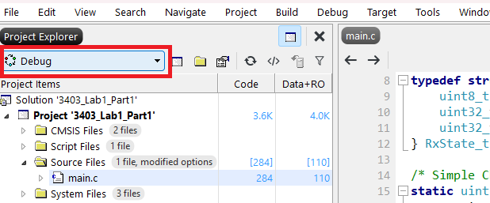
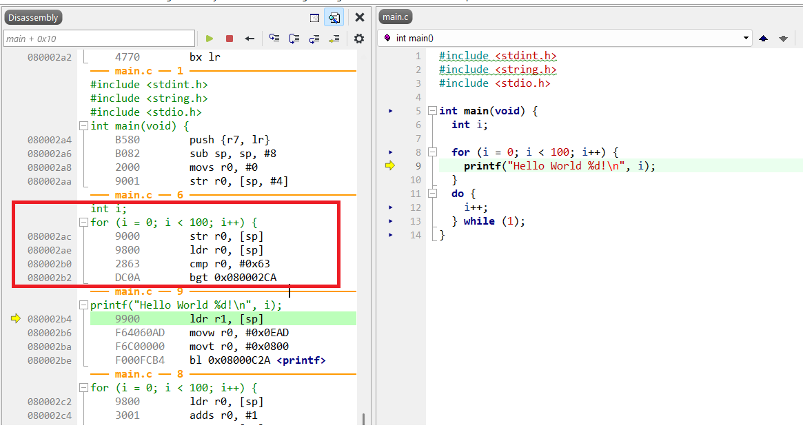
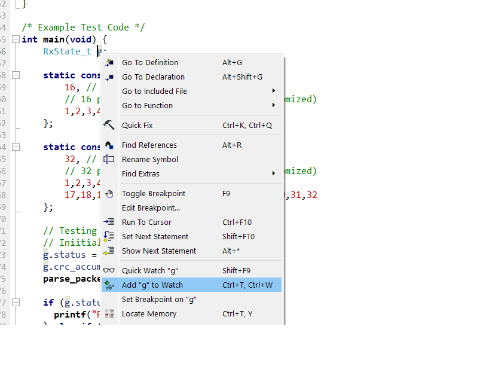
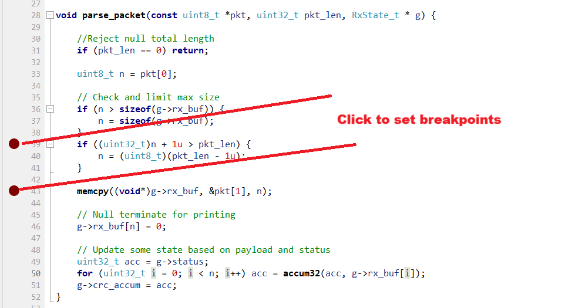

# ECED3403 Lab1: Debugging

Before beginning the lab, ensure you have:

1. Acquired your STM32F3 Nucleo Board
2. Followed the "Lab Setup Instructions"

This lab can be completed in groups of 1-3 and is self-organized. For the *lab portion* you need only *one submission* per group.

See the Lab Format document posted in Brightspace for submission details that apply to labs.

## Part 1: Build and Debug Basics

At the end of this section, you will have:

* [ ] Built a C program to run on the STM32F3
* [ ] Observed the `printf()` output on the debugger terminal
* [ ] Used debugger commands like pause
* [ ] Used code breakpoints

### Quick Reference

The following is a quick summary of everything that happens in Part 1 - if you're already familiar with these tools, you can likely skip the detailed instructions below.

1. Make a new STM32F3 project for the `STM32F303RETx`.
2. Build and debug this code:
```C
int main(void) {
  int i;

  for (i = 0; i < 100; i++) {
    printf("Hello World %d!\n", i);
  }
  do {
    i++;
  } while (1);
}
```

### Detailed Instructions

See the video linked in Brightspace for screenshots and more details.

1. Open *SEGGER Embedded Studio*.
2. From the `File` menu select `New Project`.
3. Select as the project template `A C/C++ executable for STMicroelectronics STM32F3xx`. You can use the search (upper right corner) to quickly filter on `STM32F3`:
4. Give this a name (such as `3403_Lab1`) and hit `Next`.
5. Set the `Target Processor` as `STM32F303RETx`.
**HINT**: If you look at your STM32F3 Nucleo board, you should see the same part number written on the main microcontroller.
6. On the next screens accept the defaults of files to add, just hit *Next* until you have the project opened.
7. Click the arrows in the *Project Explorer* until you see the file *main.c*, double-click on that to open as below:
8. Under the `Build` menu select `Build <projectname` (where `<projectname>` is the name you gave it which may be different from my screenshots).
9. Observe the *Build* output window to see the amount of code and RAM usage by your project.
11. Under the `Debug` menu select `Go`. You should now see the default debug window.
**NOTE**: If you get an error indicating the J-Link is not found, you may need to reflash your J-Link on-board or install drivers for the Segger J-Link. The typical error looks like this:
12. Enable the *Disassembly* view by selecting `View` -> `Disassembly`.
13. Set a breakpoint on the `printf()` call line, reset and run the program. What is the assembly code associated with this?
14. Inspect the memory location of the `i` variable, what is the address in memory that it is located at?

### Questions and Screenshots to Record for Part 1

**HINT:** Be sure to use a screenshot shortcut such as *`WindowsKey`-`Shift`-`S`* to record higher quality screenshots when asked in labs.

1. What is the address of your variable `i` in this build?
2. When you set a breakpoint on the `printf()` statement, what is the address of the actual breakpoint? What is the assembly code associated with the `printf()` line? You can include either the assembly code in your report OR a screenshot of the disassembly window of Embedded Studio.

### Problems and Errors

See the "Lab Setup" document for some assistance with errors in this lab.

## Part 2: Exploring the Optimizer

At the end of this section, you will have:

* [ ] Observed the effect of turning optimizations *on* and *off*.

For this part of the lab, you will be changing the build type from *Debug* (which does not have optimizations enabled) to *Release* (which has optimizations enabled).

### Detailed Instructions

See the video linked in Brightspace for screenshots and more detailed.

1. In the top left corner, ensure you are building the *Debug* configuration by selecting this drop-down:

2. Rebuild the code by running `Build` -> `Rebuild Project`.
3. Start the debugger. This should be the same code as you had in Part 1. Look at the *Disassembly* window (you can open this from `View`->`Disassembly` if closed). Note how it shows the assembly code associated with the line `for (i = 0; i < 100; i++) {`, which I've shown highlighted here:

This is with *Optimizations Enabled*. The assembly code is as follows:
```asm
    str r0, [sp]
    ldr r0, [sp]
    cmp r0, #0x63
    bgt 0x080002CA
```
We can look up each instruction (see the ISA - ARM slides) to see what they do.
4. Now, switch to the *Release* configuration in the top left corner. Rebuild the code and start debugging again.
5. Look at the disassembly of this version - take a copy of the assembly code that resulted from the same C line (`for (i = 0; i < 100; i++) {`) and record this assembly. Use this to answer the questions for the lab.


### Questions and Screenshots to Record for Part 2

1. What is the difference between the *optimized* code for the line referenced and the unoptimized? Specifically include:
a. The assembly listing for the optimized version.
b. What happened to the `i` variable? Is it stored in the same location?
c. What other changes happened between the optimized and unoptimized version?

## Part 3: Finding a Bug

In this part of the lab, you will use a Debugger to find a bug.

### Implementation

The following code is available in a `.c` file on Brightspace. Copy the code to your debugger (e.g., replace contents of `main.c`):

```c
#include <stdint.h>
#include <string.h>
#include <stdio.h>

#define STATUS_START 0x11AABBCCul
#define STATUS_CRCOK 0xDEADDEEDul

typedef struct {
    uint8_t  rx_buf[32];
    uint32_t status;        // Must NOT change during parsing
    uint32_t crc_accum;     // Used to compute "response"
} RxState_t;

/* Simple Checksum (CRC inspired but made easier to code) */
static uint32_t accum32(uint32_t acc, uint8_t b) {
    acc ^= (uint32_t)b;
    acc = (acc << 5) | (acc >> 27);
    acc += 0x9E3779B9u;
    return acc;
}

/* Packet processing:
  pkt[0] is payload length
  pkt[1:..] is payload data
  pkt_len is total length
  */

void parse_packet(const uint8_t *pkt, uint32_t pkt_len, RxState_t * g) {
  
    //Reject null total length
    if (pkt_len == 0) return;

    uint8_t n = pkt[0];

    // Check and limit max size
    if (n > sizeof(g->rx_buf)) {
        n = sizeof(g->rx_buf);
    }
    if ((uint32_t)n + 1u > pkt_len) {
        n = (uint8_t)(pkt_len - 1u);
    }

    memcpy((void*)g->rx_buf, &pkt[1], n);

    // Null terminate for printing
    g->rx_buf[n] = 0;

    // Update some state based on payload and status
    uint32_t acc = g->status;
    for (uint32_t i = 0; i < n; i++) acc = accum32(acc, g->rx_buf[i]);
    g->crc_accum = acc;
}

/* Example Test Code */
int main(void) {
    RxState_t g;
   
    static const uint8_t pkt_A[] = {
        16, // length
        // 16 payload bytes follow (will be customized)
        1,2,3,4,5,6,7,8,9,10,11,12,13,14,15,16,
    };

    static const uint8_t pkt_B[] = {
        32, // length
        // 32 payload bytes follow (will be customized)
        1,2,3,4,5,6,7,8,9,10,11,12,13,14,15,16,
        17,18,19,20,21,22,23,24,25,26,27,28,29,30,31,32
    };
  
    // Testing my function
    // Iniitial values
    g.status = STATUS_START;
    g.crc_accum = 0;
    parse_packet(pkt_A, sizeof(pkt_A), &g);
  
    if (g.status == STATUS_START){
      printf("Processing Started\n");
    } else if (g.status == STATUS_CRCOK){
      printf("CRC Validated OK\n"); 
    } else {
      printf("Invalid status: %08x\n", g.status);
    }

    // Set breakpoint here
    while (1) { __asm volatile ("nop"); }
}
```

It is assumed you already completed *Part 1* and *Part 2*, and can successfully build and debug code.

See the video linked in Brightspace for screenshots and more detailed.

### Running Code Normally

1. Set your build type back to `Debug`.
2. Build the code and start the debug session. It should start at the `main()` function and pause.
3. Set a breakpoint at the end of the `main()` function (the line that says `\\Set breakpoint here`).
4. Run the code, it should pause at the breakpoint.
5. Right-click on the `g` variable and hit `Add to Watch`:

7. Expand the watch values - check the values of `g.status` and `g.crc_accum`. Record the values of this initial code.
8. Change `pkt_A` to instead include the numeric part of your B00 number, for example if my student ID was `B00123456`:
```
    static const uint8_t pkt_A[] = {
        8, // length
        // 8 payload bytes follow (will be customized)
        0,0,1,2,3,4,5,6
    };
```
Do this for *each* member of your group and record `g.status` and `g.crc_accum` - this will be part of your lab report.

### Triggering the Bug

1. Change the line ` parse_packet(pkt_A, sizeof(pkt_A), &g);` to instead load `pkt_B`, as shown here:
```
 parse_packet(pkt_B, sizeof(pkt_B), &g);
```
**IMPORTANT**: Be sure to change *both* `pkt_B` mentions - note you need to change both the first call and the `sizeof()` call.
2. Run the code & stop at the breakpoint as before.
3. Observe the value of `g.status`, compare it to valid values defined at the start of the value. Does it match a valid value? What is the difference (write it down as a sequence of four bytes to see the difference).

### Debugging

1. You know the value of `g.status` is being corrupted. You must find where it is happening now.
2. Set a number of breakpoints in the `parse_packet()` function. You should use the `single step` feature, and have the `Watch` or `Locals` window open. This will help you see exactly when the variable gets corrupted. For example here is me setting a few breakpoints to start:

4. Record the instruction that actually corrupts the `g.status` variable - see observations required.
5. Can you find the *root cause* of this bug? You may need to make adjustments to how the program works or to data structure definitions.
6. Fix the bug and run the program - compare the results of `pkt_B` (which is 32 bytes long) with the bug fixed and the original code.


### Questions and Screenshots to Record for Part 3

1. From Step 6 in "Running Code Normally", fill in this table:

| pkt_A Payload                 | pkt_A Length | g.status | g.crc_accum |
|-------------------------------|--------------|----------|-------------|
| `1, 2, 3, 4, 5,` ... `15, 16` | `16`         | FILL IN  | FILL IN     |
| `0, 0, 1, 2, 3, 4, 5, 6`      | `8`          | FILL IN  | FILL IN     |

NOTE: The 2nd example would be if my student ID was *B00123456*. Your student ID will be different so your payload will be different. Include as many members in your group for all their IDs.

2. When the bug is triggered, what is the value of `g.status`? What is the difference between this invalid value and the correct value?
3. When `g.status` is overwritten, what is the actual instruction that does that? Include both the high-level C instruction, as well as the disassembly instruction.
4. Can you find the bug in the program? How can you fix it?
5. What is the value of `g.status` and `g.crc_accum` in the original code for `pkt_B`, and in your fixed version of the code?

## Submission and Marking

The lab write-up should follow the format as posted in Brightspace - note you are primarily marked on answer to the lab questions. There is no need to duplicate the entire lab procedure, but include a short *reflections* section discussing any challenges you had or specific interesting observations outside of what was asked in the lab itself.