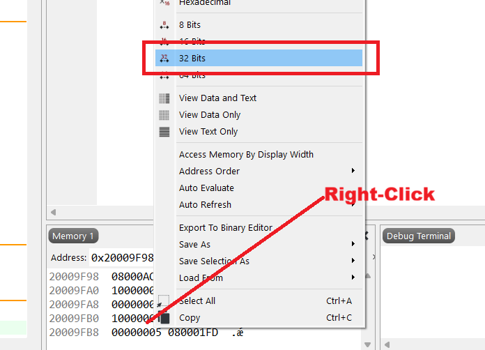
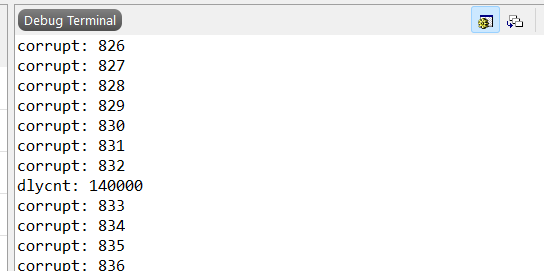
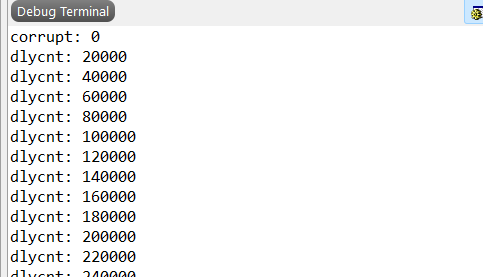
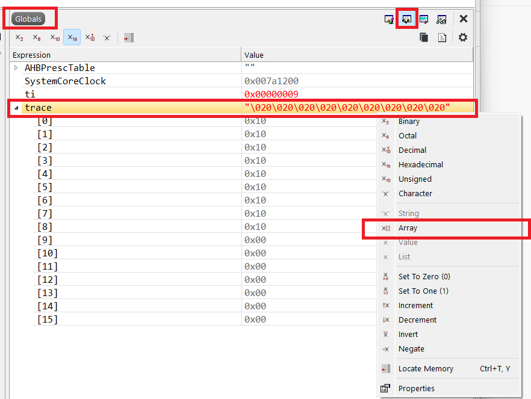
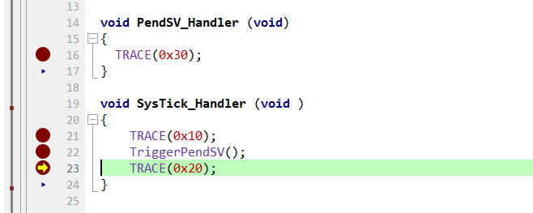
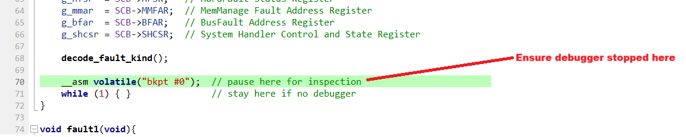
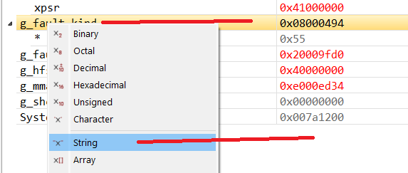
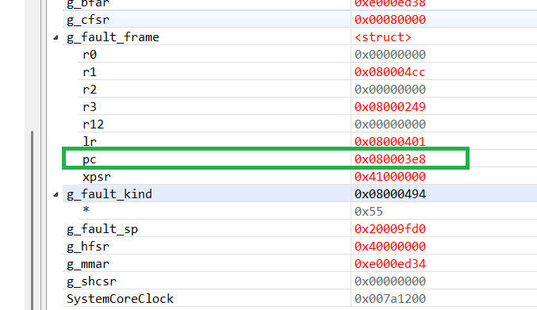

# ECED3403 Lab2: Interrupts & Exceptions

Before beginning the lab, ensure you have:

1. Completed Lab 1, including setting up the development board
2. Attended or viewed the interrupt and exception lectures

This lab can be completed in groups of 1-3 and is self-organized. For the *lab portion* you need only *one submission* per group.

See the Lab Format document posted in Brightspace for submission details that apply to labs.

Note this lab is available in markdown from the course repository: [https://github.com/colinoflynn/eced3403-computer-architecture/tree/main/labs/lab2](https://github.com/colinoflynn/eced3403-computer-architecture/tree/main/labs/lab2). 

## Part 1: Interrupt Handler Basics

At the end of this section, you will have:

* [ ] Learned how to add a new interrupt handler on a STM32F3 build.
* [ ] Explored the contents of the stack on entry to the handler.
* [ ] Observed how an atomic operation prevents maskable interrupts.


### Interrupt Handler Creation and Stack

1. Create a new project (see previous lab). Replace the contents of `main.c` with the following code:

```c
#include <stdio.h>
#include <stdint.h>
#include "stm32f3xx.h"

int main(void) {

    //Enable the SysTick Interrupt
    SysTick->LOAD = 1000;
    SysTick->VAL  = 0;
    SysTick->CTRL = SysTick_CTRL_CLKSOURCE_Msk |
                    SysTick_CTRL_TICKINT_Msk | 
                    SysTick_CTRL_ENABLE_Msk;

    //Do work here if needed
    while(1) {
      ;
    }
}
```

2. Build, debug, and run the code. Note there is **no interrupt handler** in the above code.

3. The interrupt will occur, but no handler is defined. Pause the debugger and inspect where the current execution is located. What happened (see questions - you need to write down an observation here)?

4. Make a stub interrupt handler - remember from the class lecture this is done by just defining a new function with the interrupt name (`SysTick_Handler`) which you should have seen in the previous step.

5. Set a breakpoint in the interrupt handler - as there is nothing done in the handler you will likely see a breakpoint set on the `bx lr` line in the assembly view.

6. Run the code and confirm your breakpoint hits, indicating the ISR is now being called.

7. To observe the stack, we need a more complex code that has some data in registers. To force this to be specific data, modify your `main.c` to include some loads as shown below:

```c
    asm volatile("ldr r0, =0x123456"); //Student ID - 1st
    asm volatile("ldr r1, =0x223456"); //Student ID - 2nd
    asm volatile("ldr r2, =0x222456"); //Student ID - 3rd (if applicable)
    asm volatile("ldr r3, =0x329848"); //Pick a random number

    //Do work here if needed
    while(1) {
      ;
    }
```

**NOTE**: Be sure to modify the values of the loads as shown in the comments - you MUST have screenshots of the stack showing the values matching your submitted student IDs (in hex).

8. Build, debug, and run the code as modified above. Your breakpoint should again be hit.

9. Open the CPU register view - you should see register values matching what you set above, and the stack pointer is the pointer inside the interrupt. **Be sure you are viewing this after the breakpoint was hit in the ISR**.

10. Copy the stack pointer value to the memory view (you also did this in Assignment 1). Switch the memory view to 32-bit which will make it easier to see register data on the stack:



Observe the location of the stack pointer in the memory. Remember this is *after* interrupt, you can see the stack contents in Slide 33 of Lecture 3.0.

In the questions for this lab, you will need to keep a **screenshot of the memory window** and also create a table showing the stack contents, including both value in memory and what it represents (such as `R0`, etc). 

### Using Atomic Operations

As discussed in class, atomic operations can be required to prevent a **race conditions**, where a variable is modified in both the interrupt and the main code.

Replace `main.c` with the following code (this is also available in the repository):

```c
#include <stdio.h>
#include <stdint.h>
#include "stm32f3xx.h"

volatile int a;
volatile int inv_a;
volatile int corrupt_count = 0;

void SysTick_Handler (void ) {
    if (inv_a != ~a) {
        corrupt_count++;
    }
}


int main(void) {

  SysTick->LOAD = 1000; // reload value
  SysTick->VAL  = 0;
  SysTick->CTRL = SysTick_CTRL_CLKSOURCE_Msk |
                  SysTick_CTRL_TICKINT_Msk | 
                  SysTick_CTRL_ENABLE_Msk;
  int dlycnt = 0;
  int old_corrupt = -1;

  while(1) {
    if(old_corrupt != corrupt_count){
      printf("corrupt: %d\n", corrupt_count);
      old_corrupt = corrupt_count;
    }

    a++;
    inv_a = ~a;

    dlycnt++;

    if((dlycnt % 20000) == 0){
      printf("dlycnt: %d\n", dlycnt);
    }
  }
}
```

Build, run and debug this code. Observe the questions to answer about the code as run before proceeding to the next part.

Note that you should see printing to the terminal the **corrupt** counter incrementing, along with occasional **dlycnt** values printed. The following shows the **Debug Terminal** window from running the provided code:



The following has some **atomic primitives** you can use to fix the above code:

```c
static inline uint32_t atomic_enter(void) {
    uint32_t pm = __get_PRIMASK();
    __disable_irq();
    return pm;
}
static inline void atomic_exit(uint32_t pm) {
    __set_PRIMASK(pm);
}

// Convenience macro that looks like atomic(...)
#define atomic(block) do { \
    uint32_t __pm = atomic_enter(); \
    block \
    atomic_exit(__pm); \
} while (0)
```

To use them, you will need to add an `atomic_enter()` before, and an `atomic_exit()` after:

```c
int32_t __pm = atomic_enter();
//c code to protect here
atomic_exit(__pm);
```

You will notice that the code does more than just enable and disable interrupts - this is to maintain the correct interrupt status after as before.

Add `int32_t __pm = atomic_enter();` before the relevant code in the loop, and `atomic_exit(__pm);` after. Run & debug the code - you should now see **no** corruption occuring, but **dlycnt** continues to increment. Note you should not just disable interrupts, you can use the debugger to confirm the interrupt is still occuring (but no corruption is flagged).



### Questions for Part 1

Answer the following questions about Part 1 of the lab:

#### 1-A: Interrupt Handler & Stack

1. Show a screenshot of the memory window showing the stack contents on IRQ entry.
2. Create a table showing the stack contents as an offset from the stack pointer, including both value in memory as well as what it repreents (such as `R0`, `PC`, etc). Such a table exists in the lecture slides to help you, you will need to additionally annotate this with the **actual values in memory** you observed.

#### 1-B: Atomic Operations

4. What is the function of the different sections of this code (such as the interrupt and main code), and under which condition does corruption occur (and how is it detected)?
5. Where in the code should the operations be performed "atomically" to prevent this corruption based on your inspection of the code.
6. Where did you insert the atomic operations specifically in your example - include a snippet of the code with the `atomic_enter()` and `atomic_exit()`.
7. You will notice that `atomic_enter()` *saves and restores* the interrupt state from the start to the end. Why do you think this is necessary, instead of always just disabling and re-enabling them? Consider what might happen if we had nested code which might itself be inside atomic blocks.

## Part 2: Interrupt Handler Priorities

At the end of this section, you will have:

* [ ] Added a second interrupt handler to the system.
* [ ] Observed interrupt handler priorities.

### Setup

Replace your `main.c` with the following code:

```c
#include <stdio.h>
#include <stdint.h>
#include "stm32f3xx.h"


// Helper Function - generate "trace" in memory array
volatile uint8_t trace[16];
volatile uint32_t ti = 0;
#define TRACE(x) do { trace[ti++ & 15] = (x); } while(0)

// Trigger PendSV
#define TriggerPendSV()   {SCB->ICSR = SCB_ICSR_PENDSVSET_Msk;}

void SysTick_Handler (void )
{    
    TRACE(0x10);
    TriggerPendSV();
    TRACE(0x20);
}


int main(void) {
  NVIC_SetPriority(SysTick_IRQn, 5);
  NVIC_SetPriority(PendSV_IRQn, 10);

  SysTick->LOAD = 720000; // reload value
  SysTick->VAL  = 0;
  SysTick->CTRL = SysTick_CTRL_CLKSOURCE_Msk |
                  SysTick_CTRL_TICKINT_Msk | 
                  SysTick_CTRL_ENABLE_Msk;

  while(1) {
    ;
  }
}
```

Run the code and observe the new interrupt handler that is being called. You can pause the code and you see it stuck in another stub handler. You'll need to add a handler to the `main.c` file with the body:

```c
void ??????? (void)
{
  TRACE(0x30);
}
```

Where you will need to replace `???????` with the name of the handler defined in the vector file that you observed the code stuck in.

Run the code now, and inspect the value of the `trace[]` variable. To do this, switch to the `globals` window or add the `trace` variable to a watch. You may need to set this as an array as shown here:



In the above screenshot you can see it contains the value `0x10, 0x10, 0x10, 0x10, ...`. This sequence was recorded with software that did not trigger all of the interrupts.

In your example, you should see a different sequence, which should match calls to the `TRACE()` macro. Using this you can see the code path. These sorts of macros can be helpful where pausing the code may cause issues (like in interrupts).

**WARNING**: The trace macro here is very simple, and runs continously. You thus may see some "overlap" as it overwrites itself. For example if you see the sequence `0x10, 0x20, 0x30, 0x10, 0x20, 0x30, 0x30`, that last `0x30` (which appears repeated) is just that you paused the list in the middle of an update. Ignore that for this lab - for this lab the sequences are always consistent (in this example the sequence would be `0x10`->`0x20`->`0x30`. Look for the most likely pattern when understanding the trace.

### Priority Modification

The following code sets numeric values to the interrupt priorities:

```c
  NVIC_SetPriority(SysTick_IRQn, 5);
  NVIC_SetPriority(PendSV_IRQn, 10);
```

Based on your knowledge of arm interrupt priorities, you can see the sequence of calls that is (e.g., which `TRACE()` was called in which sequence).

Change around the order of the priorities (e.g., change the argument of 5 for 10 so the priorities are opposite). Rebuild and re-run the code. What happens now?

Change so that priorities are the **same**. Run the code and determine what happened in this case.

You may also try setting break-points within the interrupts to see the program flow. If doing this, I suggest using breakpoints and not just single-stepping to avoid confusion with the macros:



### Questions for Part 2

1. What was the name of the interrupt handler you had to add?
2. What was the program flow for the initial interrupt priorities (e.g., when an interrupt was triggered inside an interrupt, what happened?).
3.  What was the program flow for the "flipped" interrupt priorities (e.g., when an interrupt was triggered inside an interrupt, what happened?).
4.   What was the program flow for the identical interrupt priorities (e.g., when an interrupt was triggered inside an interrupt, what happened?).


## Part 3: Hard Fault Debugging

At the end of this section, you will have:

* [ ] Learned how to add a hardfault handler to a Cortex-M system.
* [ ] Explored several hardfault conditions to understand what the resulting cause was.

### Setup

The following code contains three different hardfault routines. You will be asked to rebuild this by commenting out the `C` code so that each routine is called in sequence. Before doing this, try building and running the code as-is:

```c
#include <stdio.h>
#include <stdint.h>
#include "stm32f3xx.h"


void fault1(void){
  asm volatile("mov.w r0, #0xFFFFFFFF");
  asm volatile("blx r0");
  asm volatile("movs r2, #00");
}

void fault2(void){
  asm volatile("mov.w r1, #0xFFFFFFFF");
  asm volatile("movs r0, #00");
  asm volatile("str r0, [r1]");
  asm volatile("movs r2, #00");
}

void fault3(void) {
  asm volatile("movs r0, #00");
  asm volatile("movs r2, #00");
  __asm volatile(".word 0xFEFFFEFF\n");
  asm volatile("movs r0, #00");
  asm volatile("str r0, [r1]");
}

int main(void) {

  fault1();
  //fault2();
  //fault3();

  while(1) {
    ;
  }
}
```

You'll run into the default HardFault handler. Instead of using that, the following code can be added to your file:


```c
typedef struct {
    uint32_t r0, r1, r2, r3;
    uint32_t r12, lr, pc, xpsr;
} stacked_frame_t;

volatile uint32_t g_cfsr, g_hfsr, g_mmar, g_bfar, g_shcsr;
volatile stacked_frame_t g_fault_frame;
volatile uint32_t g_fault_sp;

volatile const char *g_fault_kind;

static void decode_fault_kind(void) {
    uint32_t cfsr = SCB->CFSR;

    // Memory Management Fault bits live in CFSR[7:0]
    if (cfsr & 0x000000FFu) {
        g_fault_kind = "MemManage fault";
        return;
    }
    // Bus Fault bits live in CFSR[15:8]
    if (cfsr & 0x0000FF00u) {
        g_fault_kind = "BusFault";
        return;
    }
    // Usage Fault bits live in CFSR[31:16]
    if (cfsr & 0xFFFF0000u) {
        g_fault_kind = "UsageFault";
        return;
    }
    g_fault_kind = "Unknown/HardFault escalation";
}

__attribute__((naked)) void HardFault_Handler(void) {
    __asm volatile(
        // Determine which stack pointer was in use when the fault happened.
        // If bit 2 of LR (EXC_RETURN) is 0 => MSP was used; else PSP was used.
        "tst lr, #4\n"
        "ite eq\n"
        "mrseq r0, msp\n"
        "mrsne r0, psp\n"
        "b hardfault_c\n"
    );
}

void hardfault_c(uint32_t *sp) {
    g_fault_sp = (uint32_t)sp;

    // Copy the stacked registers into a global struct
    g_fault_frame.r0   = sp[0];
    g_fault_frame.r1   = sp[1];
    g_fault_frame.r2   = sp[2];
    g_fault_frame.r3   = sp[3];
    g_fault_frame.r12  = sp[4];
    g_fault_frame.lr   = sp[5];
    g_fault_frame.pc   = sp[6];
    g_fault_frame.xpsr = sp[7];

    g_cfsr  = SCB->CFSR;   // Configurable Fault Status Register
    g_hfsr  = SCB->HFSR;   // HardFault Status Register
    g_mmar  = SCB->MMFAR;  // MemManage Fault Address Register
    g_bfar  = SCB->BFAR;   // BusFault Address Register
    g_shcsr = SCB->SHCSR;  // System Handler Control and State Register

    decode_fault_kind();

    __asm volatile("bkpt #0");  // pause here for inspection
    while (1) { }               // stay here if no debugger
}
```


This was the same handler used in my lectures on the HardFault, you may find that useful as it shows me using this code in the debugger. In particular, run the code until you reach the `//pause here for inspection` line:



You can then change the `g_fault_kind` global to a `string` to observe the fault kind:



Finally you can also observe the stack pushed on the exception stack, for example here is the `PC` value:



As discussed in class, this may be slightly **after** the instruction which caused the fault.

### Questions for Part 3

For each of the faults, observe the fault kind and fault frame including program counter (PC). Using the debugger, you can scroll the window back to the FLASH memory of the PC to see the assembly instructions around the PC. This should suggest what operations were occuring. First, fill in this table:

| Fault Function | Fault Kind | Fault Frame PC | Instructions around Fault Frame PC |
|----------------|------------|----------------|------------------------------------|
| `fault1()`     | FILL IN    | FILL IN        | FILL IN                            |
| `fault2()`     | FILL IN    | FILL IN        | FILL IN                            |
| `fault3()`     | FILL IN    | FILL IN        | FILL IN                            |

For each of the 3 faults, also discuss:

* What you think caused the fault (such as invalid instructions, invalid memory, etc). The fault names will give you a strong suggestion of the reason, but you should be able to inspect the instructions to determine the more likely cause.

* How correlated the *Fault Frame PC* was with where you think the fault occurred. As discussed in class, the PC value itself may depend on how quickly the fault was raised, which may differ with the code.

Note for the last two items bullet points you do not need a definitive answer - instead I'm looking to see some analysis of the available data, so do not worry about getting the exact right answer. When debugging we often are making educated guesses, but the process of exploring the system alone is helpful.

## Submission and Marking

The lab write-up should follow the format as posted in Brightspace - note you are primarily marked on answer to the lab questions. There is no need to duplicate the entire lab procedure, but include a short *reflections* section discussing any challenges you had or specific interesting observations outside of what was asked in the lab itself.