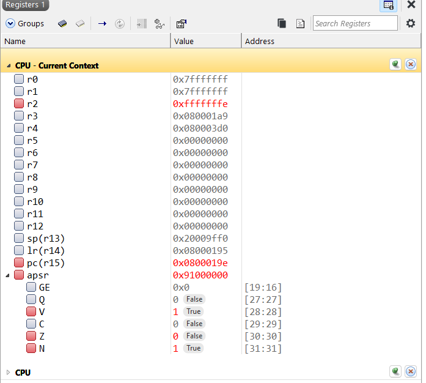

# Lab 4: ALU Operations and Pipeline Performance

## Part 1: ALU Operation and Status Flags

In the first part of the lab, you will explore the ALU operations and how they impact the various flags.

To do this, you can use a very simple program such as the following:

```c
#include "stm32f3xx.h"
#include <stdint.h>
#include <stdio.h>

/* ------------------------------------------------------------- */

int main(void)
{
    SystemInit();

    asm volatile("ldr r0, =0x7FFFFFFF");
    asm volatile("ldr r1, =0x7FFFFFFF");
    asm volatile("adds r2, r1, r0");

    while (1) {
    }
}
```

Set a breakpoint on the item you want to inspect (`asm volatile("adds r2, r1, r0");`). You can then observe the state of the status register flags. Use the *Registers* view, and expand the `apsr` register (note here this is part of the *Current Context* window):



Note this will not show you if flags were updated, just the current state of them. In the following table you will be asked to excercise 25 different instructions and see the resulting flags.

#### 1-1: Table [ 25 pts ]

Fill in the following table (when recreating, you only need to include the `#` column, and the resulting flags `N`, `Z`, `C`, `V`, and `R2`). You can find markdown source at [https://github.com/colinoflynn/eced3403-computer-architecture/tree/main/labs/lab4](https://github.com/colinoflynn/eced3403-computer-architecture/tree/main/labs/lab4).

| #  | Instruction | `R0` (A)     | `R1` (B)     | N | Z | C | V | `R2` (Rd) |
|----|-------------|--------------|--------------|---|---|---|---|-----------|
| 1  | `ADD `      | `0x00000001` | `0x00000001` |   |   |   |   |           |
| 2  | `ADDS`      | `0x00000001` | `0x00000001` |   |   |   |   |           |
| 3  | `ADDS`      | `0xFFFFFFFF` | `0x00000001` |   |   |   |   |           |
| 4  | `ADDS`      | `0x7FFFFFFF` | `0x00000001` |   |   |   |   |           |
| 5  | `ADDS`      | `0x80000000` | `0x80000000` |   |   |   |   |           |
| 6  | `SUBS`      | `0x00000005` | `0x00000007` |   |   |   |   |           |
| 7  | `SUBS`      | `0x00000007` | `0x00000005` |   |   |   |   |           |
| 8  | `SUBS`      | `0x00000001` | `0x00000001` |   |   |   |   |           |
| 9  | `CMP `      | `0x00000005` | `0x00000005` |   |   |   |   | ---       |
| 10 | `CMP `      | `0x00000005` | `0x00000007` |   |   |   |   | ---       |
| 11 | `CMP `      | `0x00000007` | `0x00000005` |   |   |   |   | ---       |
| 12 | `ANDS`      | `0xF0F0F0F0` | `0x0F0F0F0F` |   |   |   |   |           |
| 13 | `ANDS`      | `0x80000000` | `0xFFFFFFFF` |   |   |   |   |           |
| 14 | `ORRS`      | `0x00000000` | `0x80000000` |   |   |   |   |           |
| 15 | `EORS`      | `0xAAAAAAAA` | `0x55555555` |   |   |   |   |           |
| 16 | `EORS`      | `0xFFFFFFFF` | `0xFFFFFFFF` |   |   |   |   |           |
| 17 | `MOVS`      | `0x00000000` | ---          |   |   |   |   |           |
| 18 | `MOVS`      | `0x80000000` | ---          |   |   |   |   |           |
| 19 | `LSLS`      | `0x80000000` | `1`          |   |   |   |   |           |
| 20 | `LSLS`      | `0x40000000` | `1`          |   |   |   |   |           |
| 21 | `LSRS`      | `0x00000001` | `1`          |   |   |   |   |           |
| 22 | `LSRS`      | `0x80000000` | `1`          |   |   |   |   |           |
| 23 | `ASRS`      | `0x80000000` | `1`          |   |   |   |   |           |
| 24 | `ASRS`      | `0x00000001` | `1`          |   |   |   |   |           |
| 25 | `ADDS`      | `0xFFFFFFFF` | `0xFFFFFFFF` |   |   |   |   |           |

#### 1-2: Questions [ 15 pts ]

##### 1-2-1: Flag [ 1 pt ]

Compare #1 (`ADD`) with #2 (`ADDS`) - these are the same instruction but with the `S` suffix. What does this suffix mean, are the flag results from #1 valid?

##### 1-2-2: Addition [ 3 pts ]

Interpret the flag results from #3/#4/#5, showing what the result should be (e.g., using a normal calculator) and what is held in the register. Link each of carry, overflow, and zero flags to these results.

##### 1-2-3: Subtraction [ 3 pts ]

Interpret the flag results from #6/#7/#8, showing what the result should be (e.g., using a normal calculator) and what is held in the register. Link each of carry, overflow, and zero flags to these results.

##### 1-2-4: Comparison Effect [ 5 pts ]

Notice that #9/#10/#11 have no output, they only update the flags. Reference the Arm conditional execution options (see slide deck 2.1 ISA Arm, slide #15, which contains the condition field)), what flags would you expect to be of interest from each condition (e.g., for a equals, not equals, less than, and greater than).

Make a table for those four options and show what the result of the comparison would be:

| Condition    | Comparison | Condition True ? |
|--------------|------------|------------------|
| equal        | #9         | Yes              |
| not equal    | #9         | ?                |
| less than    | #9         | ?                |
| greater than | #9         | ?                |
| equal        | #10        |                  |
...... several more rows .......
| greater than | #11        | ?                |

The goal here is that you can compare your status flag values from above to the comparison conditions.

##### 1-2-5: Shifty [ 3 pts ]

1-2-5-1) [2 pts] #20 should result in a bit being shifted to the MSB of the output register. What flag is set as a result of this? If you wanted to have an instruction that only executed when the MSB of the result was a `1`, what would that condition field setting be (see slide deck 2.1 ISA Arm, slide #15, which contains the condition field)?

1-2-5-2) [1 pts] What is the difference between `LSRS` and `ASRS`? The difference is shown when comparing #22 and #23.


## Part 2: Pipelines and Performance

In this section of the lab, you will evaluate a few different instructions to compare their performance. You will also see how branch pipeline effects change the execution time.

The following code is available here: [https://github.com/colinoflynn/eced3403-computer-architecture/blob/main/labs/lab4/eced3403_lab4_instructiontimes.c](https://github.com/colinoflynn/eced3403-computer-architecture/blob/main/labs/lab4/eced3403_lab4_instructiontimes.c).

```c
#include "stm32f3xx.h"
#include <stdint.h>
#include <stdio.h>

#define DEMCR      (*(volatile uint32_t*)0xE000EDFC)
#define DWT_CTRL   (*(volatile uint32_t*)0xE0001000)
#define DWT_CYCCNT (*(volatile uint32_t*)0xE0001004)

void dwt_init(void)
{
    DEMCR |= (1 << 24);     // Enable DWT
    DWT_CYCCNT = 0;
    DWT_CTRL |= 1;
}

uint32_t bench_run(void (*func)(uint32_t))
{
    uint32_t iters = 0x10000;
    
    DWT_CYCCNT = 0;
    uint32_t start = DWT_CYCCNT;

    func(iters);

    uint32_t end = DWT_CYCCNT;
    return (end - start) >> 16;
}

volatile uint32_t sink;

// ------------------ ALU ------------------

void bench_add_dep(uint32_t iters)
{
    volatile uint32_t x = 1;
    for (uint32_t i = 0; i < iters; i++) {
        x = x + 3;
        x = x + 3;
        x = x + 3;
        x = x + 3;
    }
    sink = x;
}

void bench_add_indep(uint32_t iters)
{
    volatile uint32_t x0=1,x1=2,x2=3,x3=4;

    for (uint32_t i = 0; i < iters; i++)
    {
        x0 += 3;
        x1 += 3;
        x2 += 3;
        x3 += 3;
    }

    sink = x0 + x1 + x2 + x3;
}

void bench_mul(uint32_t iters)
{
    volatile uint32_t x = 3;
    for (uint32_t i = 0; i < iters; i++) {
        x = x * 5;
        x = x * 5;
        x = x * 5;
        x = x * 5;
    }
    sink = x;
}

void bench_xor(uint32_t iters)
{
    volatile uint32_t x = 0x55;
    for (uint32_t i = 0; i < iters; i++) {
        x ^= 0xAA;
        x ^= 0xAA;
        x ^= 0xAA;
        x ^= 0xAA;
    }
    sink = x;
}

// ------------------ Branch ------------------

void bench_branch_backend(uint32_t iters, uint32_t mask)
{
    volatile uint32_t sum = 0;
    for (uint32_t i = 0; i < iters; i++)
    {
        if (i & mask) {
            sum += i;
        } else {
            sum += i;
        }
    }
    sink = sum;
}


void bench_branch_predictable(uint32_t iters)
{
    bench_branch_backend(iters, 0xFFFF);
}

void bench_branch_alternating(uint32_t iters)
{
    bench_branch_backend(iters, 1);
}

int main(void)
{
    dwt_init();

    printf("add_dep: %u\n", bench_run(bench_add_dep));
    printf("add_indep: %u\n", bench_run(bench_add_indep));
    printf("mul: %u\n", bench_run(bench_mul));
    printf("xor: %u\n", bench_run(bench_xor));

    printf("branch_pred: %u\n", bench_run(bench_branch_predictable));
    printf("branch_alt: %u\n", bench_run(bench_branch_alternating));

    while(1);
}
```

Using our normal debug development environment (with the `DEBUG` build type), run the code and answer the following questions.

#### 2-2 Questions [ 10 pts ]

##### 2-2-1: Base runtimes [ 6 pts ]

Fill in this table based on your run:

| Function             | Result (Cycles) |
|----------------------|-----------------|
| `add_dep`            |                 |
| `add_indep`          |                 |
| `mul`                |                 |
| `xor`                |                 |
| `branch_predictable` |                 |
| `branch_alternating` |                 |

Note that these cycles are **NOT** per-instruction. The values for the first four can be compared, and the last two (e.g., but you cannot compare the `mul` and `branch_alternating`).

Based on these results, what can you say about the execution time of the different arithmetic operations (add, mul, xor)?

##### 2-2-2: Branch and Pipelines [ 4 pts ]

Walk through several iterations of `branch_predictable` and `branch_alternating`, what is the difference in these functions (the name is not the answer here - it's not simply that one is "predictable" and one is "alternating").

In particular, look at the branch instruction within this related to the `if (i & mask)` comparison. How often is the branch taken vs. not taken?

How does this explain the difference in runtimes between these two functions?


